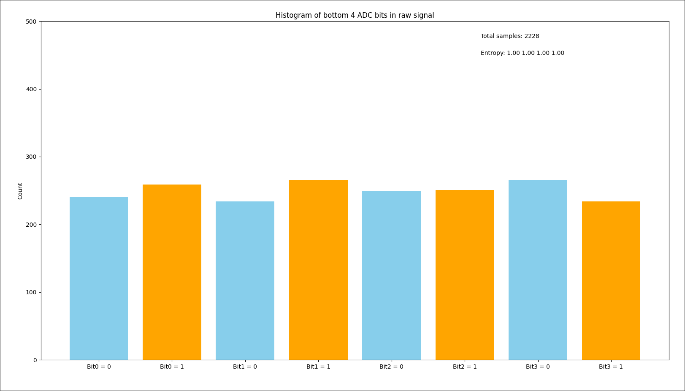
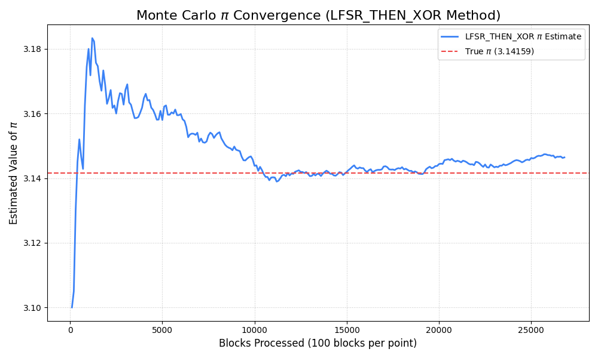

# Hardware-Based Random Number Generation  
### Using STM32 and Analog Noise

**Thobias Høivik**  
_ELE201 – Microcontrollers and Data Networks_  
Western Norway University of Applied Sciences

---

# Motivation & Goal

- Randomness is essential for:
  - Cryptography  
  - Simulations  
  - Secure communication

---

## Why This Project?

- **Pseudo-RNGs (PRNGs)** → deterministic, algorithmic  
- **True RNGs (TRNGs)** → rely on physical noise

**Goal:**  
> Can analog noise from an ADC be used as a true random number source?

---

# Theory: Randomness & Entropy

- **Entropy measures unpredictability:**
  $$
  H(X) = -\sum p(x)\log_2 p(x)
  $$
- For binary variables:  
  $H(p) = -p\log_2 p - (1-p)\log_2(1-p)$
- Max entropy when $p(0) = p(1) = 0.5$

---

# Why Can We Expect High Entropy?
- Noise inherent to all electrical circuits. 
- $V(t) = V_\text{Signal}(t) + V_\text{Noise}(t)$
- $V(t)_\text{Noise} \sim \mathcal N(0,\sigma^2_\text{Noise})$
- $\Delta V = \frac{3.3v}{12^2}$
- $\sigma_{\text{Noise}} \gg \Delta V \Rightarrow$ LSBs should be high entropy

---

# Hardware Setup

- **STM32F767ZI** with **photoresistor sensor**
- ADC samples 12-bit analog voltage
- Transmit data to PC over serial (USB)
- Keep **4 least significant bits (LSBs)** — hopefully dominated by analog noise

--- 
# Hardware Setup

---

# Data Collection & Pre-processing

- Python program receives ADC values
- Extracts **4 LSBs per reading**
- Combines into **256-bit blocks** for analysis

---

> Roughly equal bit frequency $\Leftrightarrow$ high entropy (~1 bit/bit)

---

# Statistical Testing

Based on **NIST Statistical Test Suite**  
(Rukhin *et al.*, 2010)

### Tests Used
1. **Monobit Frequency Test**
   $$
   Z = \frac{|S_n - n/2|}{\sqrt{n/4}}
   $$
   Checks 0/1 balance.
2. **Runs Test**
   - Tests alternation of bits.

---
3. **Serial Overlapping Test**
   $$
   \chi^2 = \sum (C_i - E)^2 / E
   $$
   Checks 4-bit subsequence distribution.

---

## Interpreting p-values

- Use **significance level** α = 0.01  
- Pass if **p ≥ 0.01**
- That means ≤1% chance of wrongly rejecting a truly random sequence  
✅ High p → consistent with randomness  
❌ Low p → statistically unlikely to be random

---

# Post-Processing Methods

Goal: reduce bias and correlation while keeping entropy.

---

## XOR Whitening
$$
y_i = x_i \oplus x_{i-1}
$$
- Removes local correlation
- Fast, minimal computation

## Von Neumann Corrector
- Pairs of bits:
  - (0,1) → 0
  - (1,0) → 1
  - (0,0) / (1,1) discarded
- Removes bias but reduces throughput

---

## LFSR Whitening

- Linear Feedback Shift Register using primitive polynomial  
  $$
  x^{256} + x^{10} + x^5 + 1 \in \mathbb F_2[x]
  $$
- Acts as linear filter 
- Strong whitening with no data loss

---

# Results

| Method | Monobit | Runs | Serial |
|:--------|:--------:|:----:|:------:|
| Raw | 79% | 9% | 45% |
| XOR | 92% | 12% | 57% |
| LFSR | 99% | 23% | 94% |
| LFSR → XOR | 98% | 24% | 93% |
| LFSR → VN → XOR | **99%** | **22%** | **95%** |

- Monobit & Serial tests greatly improved  
- Runs test still low (minor correlation)

---

# Monte Carlo π Estimation

Use RNG to simulate random (x, y) points in [0,1]²

$$
\pi \approx 4 \frac{N_c}{N}
$$

- Converged to π ≈ **3.1467** after 107,520 samples  
- Error = $|\pi - \pi_N|$ ≈ **0.005**
- "Confirms" RNG uniformity and independence

---

---

# Conclusions

✅ Analog sensor noise can be used as entropy source  
✅ Post-processing (LFSR + XOR) produces high statistical quality  
✅ Monte Carlo validation reinforces randomness  

**Future Work**
- Hardware whitening circuits  
- Cross-device entropy aggregation
- Data generation speed

---

# Thank You

**Thobias Høivik**  
_ELE201: Microcontrollers and Data Networks_  
Western Norway University of Applied Sciences  

